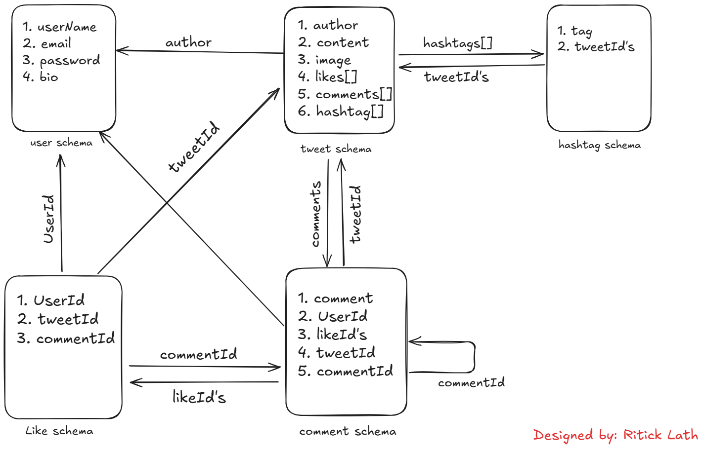

## Project Structure

- `/src/routes`  
  ⟶ Defines all API routes (endpoints).

- `/src/controllers`  
  ⟶ Handles incoming requests and calls services.

- `/src/services`  
  ⟶ Contains business logic and interacts with repositories.

- `/src/repositories`  
  ⟶ Interacts with the database using models.

- `/src/models`  
  ⟶ Defines database schemas and entities.

- `/src/config`  
  ⟶ Includes database configuration, and other settings.

- `/src/middlewares`  
  ⟶ Middleware for authentication etc.

- `/src/utils`  
  ⟶ Utility functions and helpers.

## Files

- `app.js`  
  ⟶ Main application setup.

- `server.js`  
  ⟶ Entry point to start the server.

## Functional Requirements

### User Features

1. **User Authentication** – Secure login and registration.
2. **User Profile** – View user info like name, follower count.
3. **Edit Bio** – Users can manage their personal bio.
4. **Follow/Unfollow** – Users can follow or unfollow others.
5. **Search Users** – Search for users by username or name.

### Tweeting Features

6. **Create Tweet** – Users can post new tweets.
7. **Tweet Length Limit** – Max 270 characters.
8. **Image Upload** – Attach images to tweets.
9. **Retweeting** – Share others’ tweets.
10. **Comments** – Comment on tweets. (Nesting and mentioning(v2))
11. **Likes** – Like or unlike any tweet.
12. **Mentions** – Mention other users with `@username`.
13. **Hashtags** – Use hashtags in tweets.
14. **Hashtag Suggestions** – Based on content and trends.
15. **Search Tweets by Hashtag** – Find tweets via hashtag queries.
16. **Engagement Notifications** – Users receive notifications for likes, mentions, follows, and comments. (V2)

### Feed & Engagement

17. **Feeds** – Personalized timeline:
    - Tweets from followed users
    - Trending tweets
    - Suggested tweets
18. **Pagination** – Load tweets in chunks for performance.

### Advanced / System Features

19. **Server-Driven UI for A/B Testing** – Vary UI based on server configs.
20. **Analytics for A/B Testing** – Capture performance data in company DB.
21. **Sharding or Partitioning (v2)** – Scale the DB layer for high availability.

## Database Design


https://excalidraw.com/#json=bZkg8R8HhHbd62LNmxC4m,ETP89q5iti7MfGtY7PZqog

## API Design

### Authentication APIs

1. **Register a new user** (POST)

   ```
   /api/auth/signup
   ```

2. **Log in an existing user** (POST)

   ```
   /api/auth/login
   ```

3. **Update profile (bio, username)** (PATCH)

   ```
   /api/auth/update
   ```

4. **Forgot password** (POST)
   ```
   /api/auth/forgot
   ```

### User & Profile APIs

1. **Get user profile by ID** (GET)

   ```
   /api/users/:userId
   ```

2. **Follow or unfollow a user** (POST)

   ```
   /api/users/:targetId/follow
   ```

3. **Get followers of a user** (GET)

   ```
   /api/users/:userId/followers
   ```

4. **Get following users of a user** (GET)

   ```
   /api/users/:userId/following
   ```

5. **Search users by username or name** (GET)

   ```
   /api/users/search?q=username
   ```

6. **Get follow/follower counts** (GET)
   ```
   /api/users/:userId/follow-stats
   ```

### Tweet APIs

1. **Create a tweet** (POST)

   ```
   /api/tweets
   ```

2. **Retweet a tweet** (POST)

   ```
   /api/tweets/:tweetId/retweet
   ```

3. **Get tweets of a user** (GET)

   ```
   /api/users/:userId/tweets
   ```

4. **Get detailed tweet by ID** (GET)
   ```
   /api/tweets/:tweetId
   ```

### Comment APIs

1. **Comment on a tweet** (POST)

   ```
   /api/comments/:tweetId
   ```

2. **Reply to a comment** (POST)

   ```
   /api/comments/:commentId/reply
   ```

3. **Get comments on a tweet** (GET)

   ```
   /api/comments/tweet/:tweetId
   ```

4. **Get replies to a comment** (GET)
   ```
   /api/comments/:commentId/replies
   ```

### Like APIs

1. **Like or unlike a tweet** (POST)

   ```
   /api/likes/tweet/:tweetId
   ```

2. **Like or unlike a comment** (POST)
   ```
   /api/likes/comment/:commentId
   ```

### Feed & Timeline APIs

1. **Get personalized feed** (GET)

   ```
   /api/feed
   ```

2. **Get trending tweets** (GET)

   ```
   /api/feed/trending
   ```

3. **Get paginated tweets (next set)** (GET)
   ```
   /api/feed/next?page=2
   ```

### Search APIs

1. **Search users** (GET)

   ```
   /api/search/users?q=elon
   ```

2. **Search hashtags** (GET)

   ```
   /api/search/hashtags?q=dev
   ```

3. **Get hashtag suggestions** (GET)
   ```
   /api/search/suggestions?q=nodejs
   ```

### Notification APIs (v2)

1. **Get user notifications** (GET)

   ```
   /api/notifications
   ```

2. **Mark notifications as read** (PATCH)
   ```
   /api/notifications
   ```

### Media Upload APIs

1. **Upload image for a tweet** (POST)

   ```
   /api/upload/tweet
   ```

2. **Upload profile picture** (POST)
   ```
   /api/upload/profile
   ```
